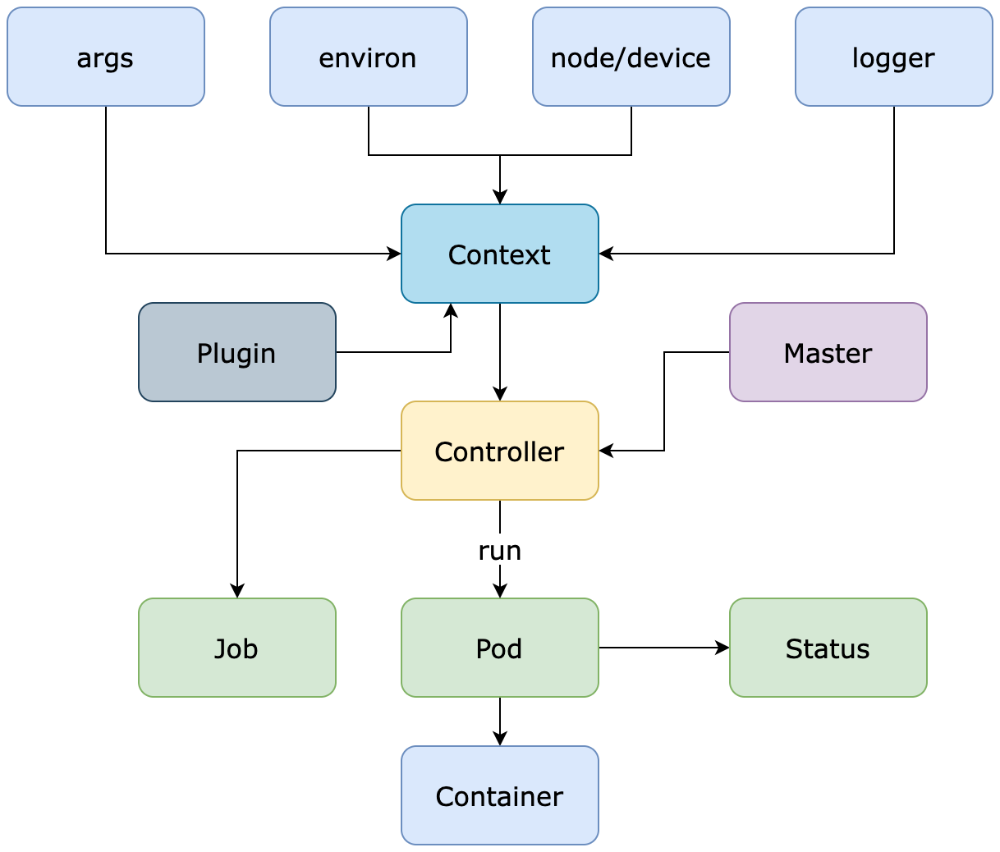

# Architecture

## Components

*Context* Launch context including four man parts: args, environ, node/device and logger.
*Controller* The main workflow definition. Can be extended to satisfy different scenarios.
*Job* The job definition.
*Pod* A pod bind to one distributed node.
*Container* An encapsulation of process or function. A pod may contains multi containers.
*Master* A master handle the information exchange among nodes.

